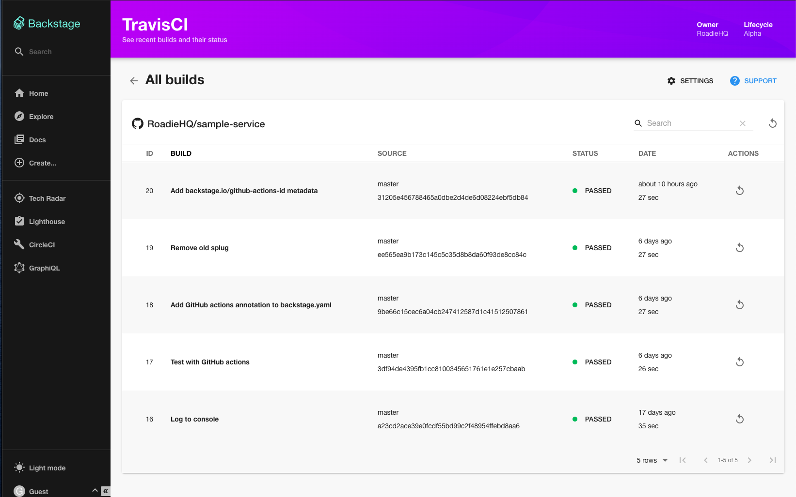

# Travis CI Plugin for Backstage



[https://roadie.io/backstage/plugins/travis-ci](https://roadie.io/backstage/plugins/travis-ci)

## Features

- List Travis CI Builds
- Retrigger builds

## How to add Travis-ci project dependency to Backstage app

If you have your own backstage application without this plugin, here it's how to add it:

1. In the `backstage/packages/app` project add the plugin as a `package.json` dependency:

```bash
yarn add @roadiehq/backstage-plugin-travis-ci
```

2. add travis-ci to the proxy object in `app-config.yaml` file in the root directory:

```yml
proxy:

  ...

  '/travisci/api':
    target: https://api.travis-ci.com
    changeOrigin: true
    headers:
      Authorization:
        $secret:
          env: TRAVISCI_AUTH_TOKEN
      travis-api-version: 3
```

3. Add plugin to the list of plugins:

```ts
// packages/app/src/plugins.ts
export { plugin as TravisCI } from '@roadiehq/backstage-plugin-travis-ci';
```

4. Add plugin to the `entitytPage.tsx` source file:

```tsx
// packages/app/src/components/catalog/EntityPage.tsx
case isTravisCIAvailable(entity):
    content = <RecentTravisCIBuildsWidget entity={entity} />;
    break;
```

## How to use Travis-ci plugin in Backstage

Travis-ci plugin is a part of the Backstage sample app. To start using it for your component, you have to:

1. add annotation to the yaml config file of a component:

```yml
travis-ci.com/repo-slug: <owner-name>/<project-name>
```

2. add your developer api key to the environmental variables for your backstage backend server (you can copy it from https://travis-ci.com/account/preferences):
   `TRAVISCI_AUTH_TOKEN="token <your-api-key>"`

## Develop plugin locally

You can clone the plugin repo into the `plugins/` directory:

```sh
git clone https://github.com/RoadieHQ/backstage-plugin-travis-ci.git travis-ci
```

and run `yarn` in the root backstage directory - it will create a symbolic link so the dependency will be provided from the source code instead of node_modules package.

## Links

- [Backstage](https://backstage.io)
- [Further instructons](https://roadie.io/backstage/plugins/travis-ci/)
- Get hosted, managed Backstage for your company: https://roadie.io
